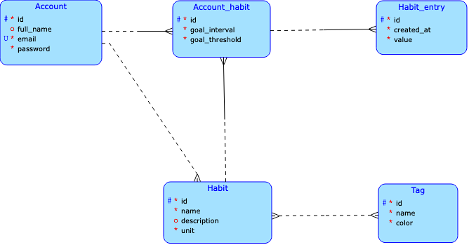

# HabitForge

HabitForge je aplikácia ktorá umožní užívateľom sledovať a zaznamenávať ich návyky (habity).
Užívateľ si bude môcť vybrať z predpripravených habitov alebo si vytvoriť svoje vlastné. Ku
každému si bude môcť nastaviť aký je jeho cieľ pri danom habite, napr. čítať 30 (account_habit.goal_interval, habit_entry.value)
minút (habit.unit) denne (account_habit.goal_threshold) a následne si zaznamenávať ako sa mu
darí jeho plnenie. Habity sa budú dať taktiež komfortne zoskupovať pomocou značiek (tagov).

## Konceptuálna schéma

## Business operácia implementovaná v klientovi

Užívateľ si bude môcť vybrať či chce použiť jeden z predvytvorených habitov, alebo si vytvorí svoj
vlastný. V prvom prípade sa iba vytvorí záznam v tabuľke account_habit, v druhom sa ešte predtým
vytvorí záznam v tabuľke habit, z pohľadu užívateľa to bude však iba jedna operácia.

## Komplexný dotaz (mimo CRUD)

Užívateľ si bude vedieť zobraziť pre daný habit súčasné plnenie cieľu, aký mu nastavil.
